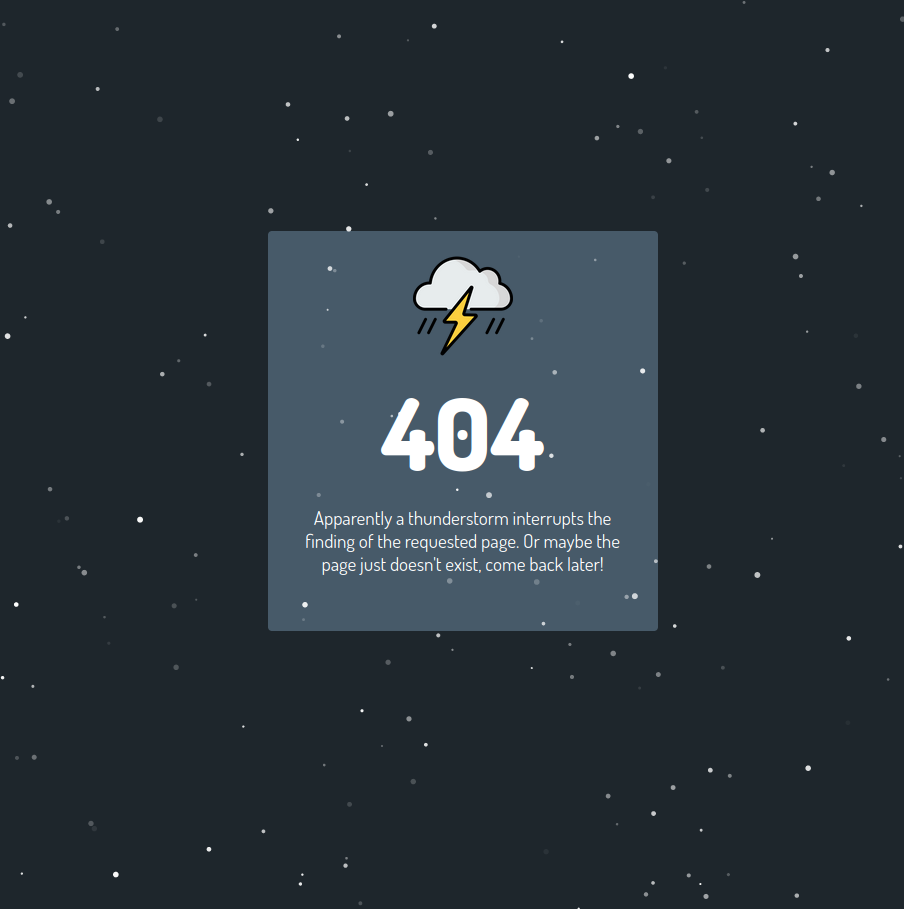

# error-page
This is a small error page developed in Vue and inspired by [this site](https://codepen.io/hellochad/pen/weMpgE).



# How to run?

Install dependencies:

```bash
npm install
```

You can directly run the application via

```bash
npm run serve
```

To build the application, execute

```bash
npm run build
```

# Production

Feel free to use the included ```nginx.conf``` and ```Dockerfile``` to run the application, for example, using Docker.

```bash
docker build -t error-page:latest .
```